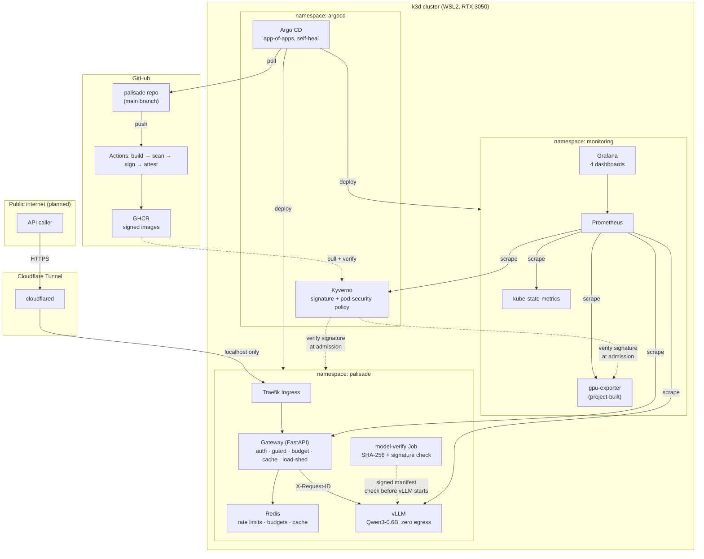
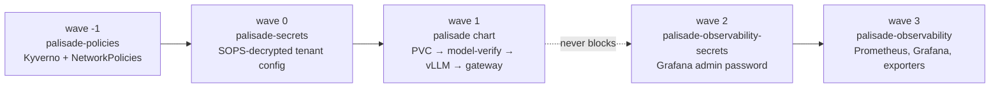
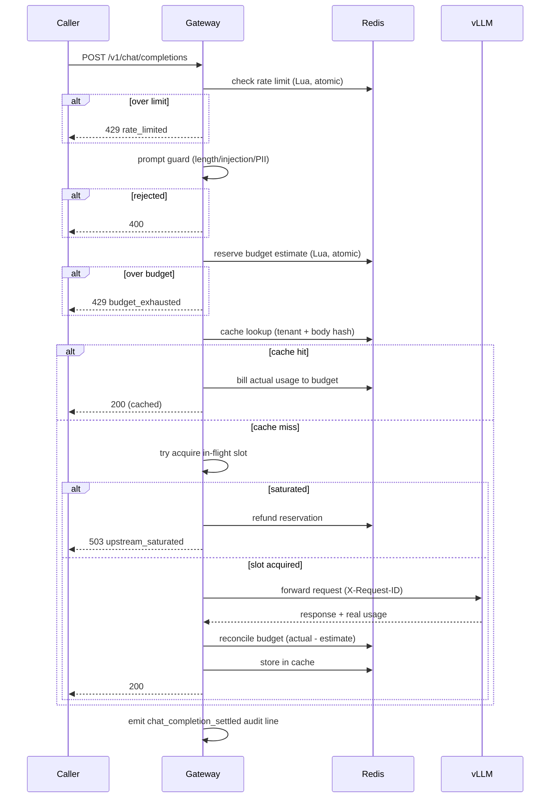

# Architecture

## System overview

## Sync-wave ordering (why things start in this order)

Policies before secrets before workloads is load-bearing: a pod
admitted before its policy exists is never re-judged until it restarts
(ADR 0020). Observability is deliberately *after* and *decoupled* -
wave 3 depends on wave 1 having succeeded, but nothing in wave 1 ever
waits on wave 3 (ADR 0023). A stalled Grafana image pull must never be
able to block the gateway or vLLM from deploying.

## The request path

Six independent checks happen before a single GPU cycle is spent, each
cheaper than the one after it - the expensive resource is protected by
a series of progressively more expensive filters, in the order their
actual cost justifies.

## Trust boundaries

| Boundary | What crosses it | What enforces it |
| --- | --- | --- |
| Public internet → Cloudflare Tunnel | HTTPS requests to the gateway only | Cloudflare's own edge TLS; tunnel exposes `/v1/*` exclusively |
| Caller → Gateway | A bearer token (hashed immediately, never retained raw) | `app/auth.py` |
| Gateway → vLLM | An already-policy-rewritten, already-budgeted request | `app/policy.py`, NetworkPolicy (gateway-only ingress to vLLM) |
| vLLM → anywhere | **Nothing** - zero egress, by policy, not by convention | `deploy/policies/networkpolicy-vllm.yaml`, ADR 0014 |
| GitHub Actions → GHCR | A signed, SBOM-attested image | Cosign keyless signing tied to the exact workflow identity |
| GHCR → Cluster | An image Kyverno has independently re-verified | `deploy/policies/kyverno-verify-signatures.yaml` - the registry's own trust is never assumed |
| Git repository → Live cluster | Any change, through Argo CD only | `selfHeal` reverts anything applied by hand |

## Why this shape, not another

See ADR 0011 (one Helm chart, not two), ADR 0012 (model verification as
a separate Job, not an init container - NetworkPolicy is per-pod, and
the verifier needs the internet while vLLM must never have it), ADR
0016 (Argo CD app-of-apps over a single flat manifest set), and ADR
0023 (observability as its own decoupled, lower-priority chain). Each
of these was a real alternative considered and rejected, not the only
option that existed.
